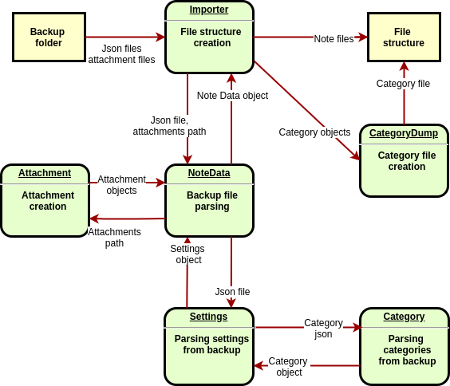
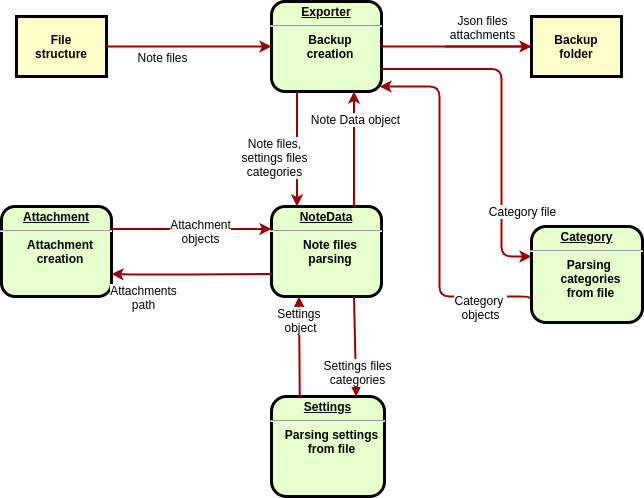

# omninotes readme

# usage

## import your notes

To import your notes from OmniNotes app you have to do backup in app. Go to Settins → Data → Sync and Backups → Backup and type name for the backup. Then you can import backup folder to your computer. Your backup directory structure should have following structure:

```bash
.
├── 1591002625529.json
├── 1591002640043.json
└── files
    └── 20200601_111656_466.jpg
```

To import your backup run.

```bash
./omninoteseditor --import /home/user/my-backup --destination /home/user/my-notes
```

Created note structure should has following structure:

```bash
.
├── My checklist_1591002625529 # checklist note with title 'My checklist'
│   ├── My checklist.cl # checklist note file
│   ├── attachments # directory with note attachments
│   └── settings.ini # settings file
├── My note_1591002640043 # text note with title 'My note'
│   ├── My note.txt # note file with note contents
│   ├── attachments #directory with note attachments
│   │   └── 20200601_111656_466.jpg # image attachment to note 'My note'
│   └── settings.ini # settings file
└── categories.ini # category database file
```

## `settings.ini`

In this file you can edit note's settings. File has following, self explaining structure:
```
[settings]
id = 1591002625529
trashed = true
archived = true
category = pieski
longitude = 18.359418
latitude = 50.064192
``` 

## create a note
To create new note in imported backup run:
```bash
./omninoteseditor --add-note --title NewNoteTitle  --source /path/to/imported/backup/dir/
```
If `--title` parameter is omitted user will be prompted,
if run with `--no-confirm` flag, note will be created with empty title.  
The newly created note will be placed in /path/to/imported/backup/dir/{note title}_{timestamp} or /path/to/imported/backup/dir/{timestamp} if title is empty 

## edit your notes

To edit text note, simply edit contents of note's `.txt` file. Same instructions apply to editing a checklist note (`.cl`), but you have to remember that is must have checklist structure, e.g.:

```
[ ] Cut tree
[ ] Smell fresh grass
[x] do the laundry
```

### change note title
Note title is resolved by reading prefix (text before `_`) from note directory name. If name doesn't have underscore in it all directory name is used for note title. 

## add an attachment

To add new attachment simply add file to `attachments` directory.

## create a category

To create new category run: 
```bash
./omninoteseditor --add-category NewCategoryTitle --color red --source /path/to/imported/backup/dir/
```
If `--color` flag is omitted user will be prompted to input color name or hex value,  
if run with `--no-confirm` flag, default color will be used.

You can also manually add a section in `categories.ini` file with unique id and color, e.g:
```ini
[NewCategoryTitle]
id = 1590959094860
color = red
```
or, equivalent:

```ini
[NewCategoryTitle]
id = 1590959094860
color = #FFFF0000
```

The list of available color names is be generated in `categories.ini` header after import.

## export your notes

To export your notes run:

```bash
./omninoteseditor --export --source /home/user/my-notes --destination /home/user/my-notes-backup
```

You can use created backup directory to import your notes to OmniNotes app. Go to Settings -> Data -> Sync and Backups -> Reestore or delete backups.

## edit settings with CLI
To edit your notes settings without editing `settings.ini` file you can run
```bash
./omninoteseditor --settings /home/user/my-notes/my-note \
  --archived true --trashed false --category not-so-important
```
## omninoteseditor options
* `--import, -i` `{backup_directory_1} [{backup_directory_2} [...]]`: use this flag to import your OmniNotes app backups
* `--export, -e` `{source_directory}`: use this flag to export your notes to OmniNotes backup directory.
* `--destination, -d` destination directory path.
        
    When used with `--import` flag specifies where imported notes directory should be created. Defaults to `./omni-notes`
    
    When used with `--export` flag specifies where OmniNotes backup directory is created. Defaults to `./omni-notes-backup/`
* `--source, -s`: use with `--add-note` and `--add-category`. Specifies source directory of your notes
* `--add-category`: use this flag for creating new category without editing `categories.ini` file
* `--no-confirm, -n`: when used with `--add-category` skips prompting user for category color,
 
    when used with `--add-note` skips prompting user for note title.
* `--add-note`: creates new note file structure in given source path
* `--settings`: use with `--trashed`, `--archived`, `--category` for editing note settings. See section edit settings with CLI

## dependencies
Python scripts depend on package `python-magic 0.4.15`. See `requirements.txt`
# development documentation

## Data flow diagrams
### Import

### Export


